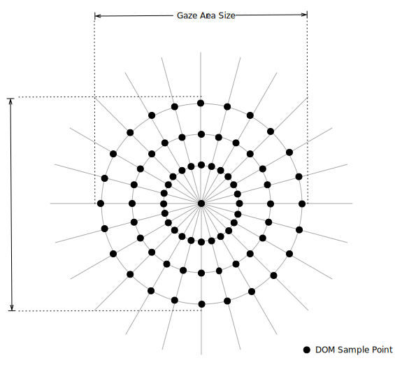
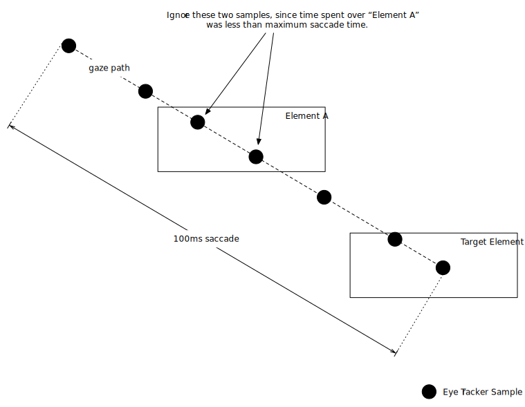
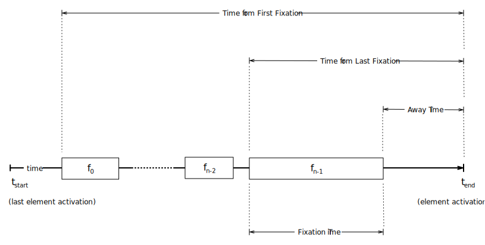
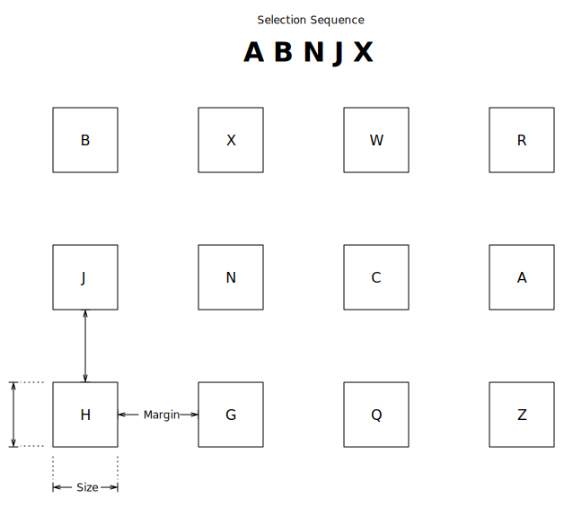
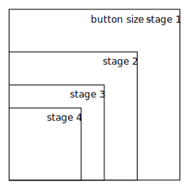
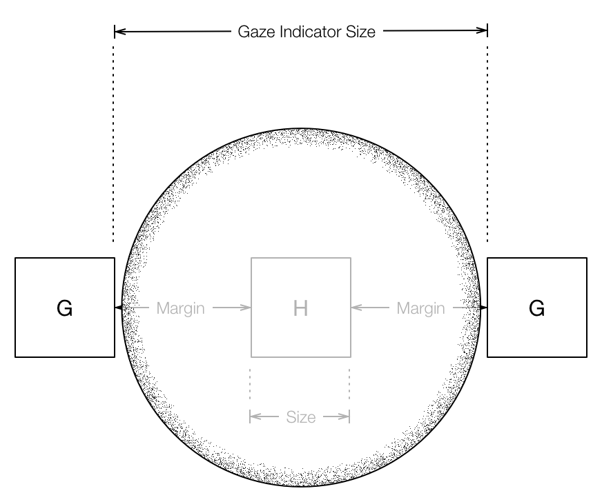

EyeJS Trial and Evaluation
==========================

## Trial Format

Trial participants will be asked to participate in a series of experiments. Each experiment will be performed by each user three times, once using a standard mouse, once using EyeJS with keypress activation, and once using EyeJS blink activation. The order of the experiments and the order of the input modes they use to complete the task (mouse, keypress, blinking) will also be randomized.

### Input Modes

There are three distinct input modes for this trial. The keyboard will be used for text entry in all modes.

#### Mouse ($ m $)

The trial participants will use a standard mouse to select elements.

#### Keypress ($ k $)

Elements are selected using a keyboard keypress using EyeJS. In this mode, users gaze at a particular element, then press a key on the keyboard to select it.

#### Blinks  ($ b $)

Elements are selected using EyeJS blink selection. In this mode, users gaze at a particular element and use a noticeably longer blink to select elements.

### Experiments Overview

We will be conducting four experiments with each participant.

#### Sythetic User Interface ($ s $)

This experiment will measure the user's accuracy and execution time when presented with a sequence of selection tasks.

#### Wikipedia Navigation and Information Extraction ($ w $)

This experiment will measure the difference in task execution time between different modes of input on a simple website.

#### Amazon.com Navigation and Information Extraction ($ a $)

This experiment will measure the difference in task execution time between different modes of input on a complex and dense website.

#### User Focus ($ f $)

This experiment will measure the amount of information gather and retained by the user with and without UI assistance from EyeJS.

### Participant Randomization

The order in-which participants complete experiments will be randomized, as well as the order of input modes they use. An example of participant experiment and input mode assignments are below. The experiment cells are tuples, the first element representing which experiment is being performed and the second the order of input modalities.

| Participant        | First Experiment  | Second Experiment | Third Experiment  | Fourth Experiment |
| ------------------ | :---------------: | :---------------: | :---------------: | :---------------: |
| John               | $ (s, kmb) $      | $ (w, kbm) $      | $ (f, mkb) $      | $ (a, bkm) $      |
| Jane               | $ (w, mbk) $      | $ (s, mkb) $      | $ (a, mbk) $      | $ (f, kbm) $      |
| Mike               | $ (a, kbm) $      | $ (w, kbm) $      | $ (f, kmb) $      | $ (s, kmb) $      |

## Things to Avoid

### Don't Evaluate the Webpage

We don't want to evaluate the design or usability of the webpages used during this trial. Only the amount of time taken to *select* navigation elements, and accuracy should be considered, not the amount of time taken to *locate* the navigation element. However, when the user is finding information and we are considering distraction caused by EyeJS, we should not give hints or clues as-to where that information is located.

## Questions to Answer

### Primary Questions

- How does user accuracy change when using EyeJS compared to a standard mouse?
- How does using EyeJS affect the speed of task completion?
- When using EyeJS, are keypress activations more accurate than blinks?
- When using EyeJS, how does activation time compare between using keypresses and blinks?
- How small can buttons and other interactive elements get before accuracy and selection ability start to degrade?
- How close can interactive elements get before accuracy and selection ability start to degrade?

### Secondary Question

- How large should the gaze area (gaze indicator) be?
- Does a visible gaze indicator increase or decrease user speed and/or accuracy? **[I think this can go away.]**
- Does automatic page scrolling decrease the amount of time it takes for users to perform the tasks? **[Should we add an experiment for automatic page scrolling?]**

## Assumptions and Parameters

### Gaze Area

The gaze area is a circular area where DOM sample points are taken by EyeJS. The samples are taken in an outward, counter-clockwise radiating fashion.

### Fixation Time

We consider a *fixation* to have occurred after the longest possible saccade (in duration). So, if the user's gaze remains over a specific element for a greater period of time than the longest saccade, then we consider this a fixation of that element. Eye tracker samples which indicate the user's gaze is over a specific element, but do not sample that same element for longer than some fixation threshold are ignored.

We define the *fixation threshold*, $\delta$, as minimum amount of time the user's gaze must be continually over an element for a *fixation* to occur.

$$ \delta = Fixation\ Threshold > Longest\ Saccade\ Duration = 120 ms $$

We assume that after the user has *fixated* on the target element, the user is aware of it's presence. In situations where the user's only intent is to select the target element, further fixations indicate gazing away from the target, or trouble selecting the target. The interpretation of this may change as data is available from the audio and video recording of the user. If a fixation is recorded but the user is unaware of the element (e.g. a recorded fixation of a target button, but the user continues searching) should be recorded as *false fixations*. Many false fixations may indicate a problem recording fixations or that an adjustment is required to fixation detection methods or parameters.

## Data and Measurements

A variety of data will be logged during each trial to analyze EyeJS performance and how the user interacted with the computer using EyeJS.

### Mouse Movements and Clicks

Mouse movements and clicking will be logged so we can compare that data to eye-tracking data when the user is using the mouse. *(e.g. How long does it take for the user to click an element after they have fixated on it?)*

### User Audio and Video

Video will be recorded using a webcam, and synced with the trial. Using this data, we can gain insight into what the user's intent was, while comparing that with their observed eye tracking and mouse data.

### Eye Tracking Measurements

All eye tracking data will be logged, even if the user is currently interacting via the mouse. This will allow us to compare EyeJS interaction with that of the standard mouse. Eye activity will be logged and synced separately from EyeJS for later for analysis.

#### Task Time

Generally, we are concerned with how long it takes the user to select some element (i.e. a button or anchor) using their assigned input mode (mouse, blinking, or keypress). This can be measured by observing the time between element activations within the task. In the diagram above, this would correspond to the difference between the last element activation (or first task start) and the target element's activation.

We define *Task Time* for the $ i ^{th} $ task of an experiment, $T \_{i} $, according to the diagram above as follows:

$$ T \_{i} = t\_{end} - t\_{start} $$

#### Number of Fixations

We are also interested in the number of times the user fixates on a target element. A singular fixation-selection indicates the user looks at the target element and selects it without changing their gaze. This is probably an ideal scenario, and it is likely that the user will shift their gaze before activating the element. For example, this could happen if they are using the mouse, they quickly shift their gaze to locate their cursor before activating the element. Also, this could be observed when activating an element using a keypress, when the user quickly looks at the keyboard to confirm they are about to press the correct key.

The above diagram shows a series of fixations over a target element, indexed $0...n-1$. We will record all fixations of all elements as the set $F$ and fixations over the target element as set $Q$. We are specifically interested in measuring the number of fixations over the target element, $ \left| Q \right| = n $, but are also interested in the total number of fixations, $ \left| F \right| $.

#### Length of Fixations

Fixations will be recorded as tuples consisting of the element the user is fixated on, and the duration of the fixation, so for some fixation $f$,

$$ f = (fixated\ element, fixation\ duration) $$

Measuring the length of each fixation will help us determine if the user dwells on a target for differing lengths of time depending on which mode of input they are using. This is measured as the difference in time between when the fixation starts, and when it ends. This will always be greater than $ \delta $.

#### Time from First Fixation

How long does it take for the user to select an element after their first fixation, regardless of the number of fixations? Since we can be assured the user intended to select the element during the last fixation, if there is a significant difference between the *Time from Last Fixation* and the *Time from First Fixation*, we should investigate if the fixations are being erroneously recorded.

#### Time from Last Fixation

Measuring from the start of the last fixation, how long does it take the user to select the element? If there is only a single fixation, then this will be the same as *Time from First Fixation*. This tells us how long the user dwells on an object before activating it. For example, if the user is using a mouse, this will indicate how long it takes for the user to get the mouse over the target and select it, while still dwelling on the target.

#### Away Time

This is the time between the last fixation and when the user select the element. If using blinks, this time corresponds to the blink activation time. If using keypresses, this could represent the user looking away from the screen and to the keyboard.

### Accuracy

User selection accuracy, $A$ will be measured as the ratio of intended element selections to total element selections.

$$ A = \frac{Intended\ Selections}{Total\ Selections} $$

For most tasks, the intended selection will be clear from the directions given to the user. If it is unclear, then the video and audio records of the user will be used to determine what their intention was.

## Experiments

### Synthetic User Interface

This task will measure the efficacy of the user when using a mouse or EyeJS when presented with a synthetic user interface and button activation tasks.

#### Task Description

This task will present the user with a screen of uniformly sized buttons and a sequence of capital letters. Each button will be randomly labeled by a single capital letter. The user must select the buttons in a specific randomly generated sequence. As the trial continues, the size of the buttons will decrease and the distance between them will change.

#### Things to Consider

- The difference in speed and accuracy of the user when using EyeJS versus a standard mouse.
- How size and density of interactive elements affect the speed and accuracy of the user.
- How does the gaze area (size of the gaze indicator) affect the user's speed and accuracy.

#### What's Changing

During this experiment, the following parameters will change: the size of the buttons, the margin between the buttons, and the size of the gaze indicator.

##### Button Size

The size of the buttons will progressively decrease. Each stage will reduce the button size by a factor of $\frac{3}{4}$. For instance, if the buttons start at 100x100 pixels, the second stage will feature buttons of 75x75 pixels, and the next 56x56 pixels, 42x42, 31x31, and so on.

##### Button Margin
The distance between interactive elements is expected to affect the accuracy of the user. Therefore, for each stage we will vary the distance between the buttons that the user must select. An example margin sequence (in pixels) is 100, 75, 50, 25, 10, 5.

##### Gaze Indicator Size
The size of the gaze indicator can change ... although this may take some testing to figure out how.

### Wikipedia Task

This task tests the user's ability locate and interpret specific information on a webpage, while navigating using eye tracking.

#### Things to Consider

- Will the user be distracted by a visible gaze indicator?
- Is the user faster or slower if the gaze indicator is visible?
- How does automatic scrolling affect the user's navigation ability and speed of navigating the page?
- Does the link-highlighting distract the user from the information they are seeking?

#### Task Sequence

1. Visit [http://wikipedia.org](http://wikipedia.org)
2. Select **English**
3. Select the **Science** portal.
4. Preview the *Selected Picture*
5. Search for "UCSD"
  - Read the number of undergraduate students enrolled at UCSD.
  - Read the number of acres of campus.
6. Navigate to *Global Rankings*
  - Read the *Washington Monthly* ranking of UCSD
  - Read the *ARWU* ranking of UCSD

### Amazon Task

#### Things to Consider

- Can the user navigate a link-dense environment like Amazon.com?
- Are they able to discover that they can select videos by looking at them, and pressing the *select* button?
- Does image *zooming* distract the user?

#### Task Sequence

1. Visit [http://amazon.com](http://amazon.com)
2. Select **Shop by Department**
3. Select **Movies, Music & Games** > *Movies & TV*
4. Select *Birdman*
5. Select the cover image.
6. Start playing the *Birdman* trailer.
7. Stop playing the trailer.
  - Read the name of the 2nd Most-Helpful Customer Review
  - Read the date of the most helpful customer review

### Reading Comprehension with Fading Sidebar

This task will utilize a [Cloze Test](http://en.wikipedia.org/wiki/Cloze_test) to measure how well the user can assimilate content from a page with potentially distracting sidebar elements. Using EyeJS, we will fade other elements from the page while the user is reading the text, only bringing them fulling into view when the user is looking at them. We are interested in determining if fading non-relavent information helps the user absorb task-related information faster or more accurately.

To ensure that the user is aware of the sidebar content, we will at some point require the user to interact with it, such as to navigate to the next page.

#### Things to Consider

- Does fading non-relavent sidebar information with potentially distracting content help the user absorb task-related information more quickly and accurately?

#### Possible Variation

Include scrolling variations to determine if automatic scrolling helps or hinders the user.
